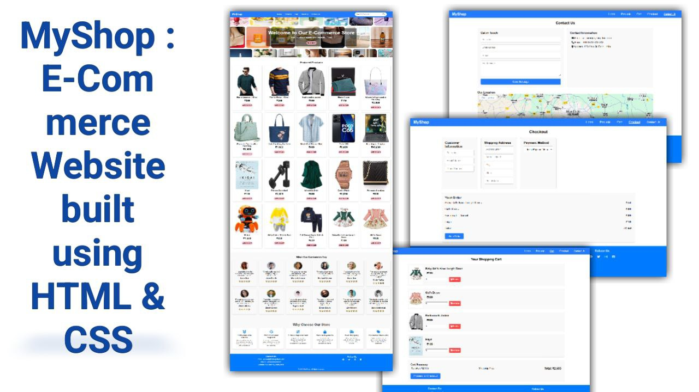

# MyShop

**MyShop** is an e-commerce website developed using HTML and CSS, designed to provide a seamless shopping experience for customers. It features various sections that allow users to browse products, manage their shopping carts, and complete purchases easily.

## Demo screenshot

## Live Demo

* You can check out the live demo of the project [here](https://premkrrajbhar.github.io/MyShop/)

## Table of Contents

- [Features](#features)
- [Technologies Used](#technologies-used)
- [Usage](#usage)
- [Contributing](#contributing)
- [Contact](#contact)

## Features

### Homepage
- **Hero Section:**
  - Contains a visually appealing image and a prominent call-to-action button (e.g., "Shop Now").
  - The hero section is designed to capture the attention of visitors and guide them towards featured products.

- **Featured Products:**
  - A grid or carousel displaying selected products, including images, names, prices, and an "Add to Cart" button.
  - Allows customers to quickly access popular items.

- **Testimonials:**
  - A section dedicated to showcasing customer reviews and feedback.
  - Helps to build trust and encourage new customers to make purchases.

- **Why Choose Our Store:**
  - Highlights unique selling points, such as quality products, excellent customer service, or competitive pricing.
  - Aids in differentiating the store from competitors.

### Cart Page
- **Shopping Cart Overview:**
  - Displays a list of items that the user intends to purchase.
  - Includes details such as product images, names, quantities, prices, and the total cost.

- **Edit Cart Functionality:**
  - Users can update quantities or remove items directly from the cart.

### Checkout Page
- **Customer Information:**
  - Input fields for users to enter their personal details (name, email, phone number).

- **Shipping Address:**
  - Fields for entering the shipping address, including street address, city, state, and ZIP code.

- **Payment Methods:**
  - Options for users to select their preferred payment method, including debit cards, credit cards, and PayPal.

- **Order Summary:**
  - Displays a comprehensive summary of the order, including itemized costs, shipping fees, and the total amount due.

- **Final Payment:**
  - A button to confirm the order and complete the payment process.

### Contact Us Page
- **Get in Touch Section:**
  - Input fields for users to send inquiries or feedback, including name, email, and message.

- **Contact Information:**
  - Provides users with direct contact details, such as a support phone number and email address.

- **Location Map:**
  - Displays the store's physical location using an iframe, allowing users to find directions.

## Technologies Used

- **HTML:** Structure of the web pages.
- **CSS:** Styling and layout of the web pages for a responsive design.

## Usage

- **Homepage Navigation:**
  - Upon opening the website, users will be greeted by the hero section. They can click the "Shop Now" button to browse featured products.

- **Adding Products to Cart:**
  - In the featured products section, users can select items and click the "Add to Cart" button to add them to their shopping cart.

- **Managing Cart Items:**
  - Users can click on the shopping cart icon to view the cart page, where they can adjust quantities or remove items.

- **Checkout Process:**
  - After confirming their cart, users can proceed to the checkout page. They will be prompted to enter their information, shipping details, and select a payment method.

- **Contacting Support:**
  - Users can navigate to the "Contact Us" page to reach out for support or inquiries.

## Contributing

Contributions are welcome! Please feel free to submit a pull request or open an issue for any suggestions or improvements.

## Contact

For any questions or comments, please reach out to :
- Email : [premkumar224487@gmail.com](mailto:premkumar224487@gmail.com)
- Github : [premkrrajbhar](https://github.com/premkrrajbhar)

